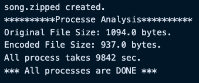

# myZip

## Development Objective.

1. Use the advantages of Huffman to real programming implementation.
2. Transform the large size of data to small size one.

---

## Introduction

Huffman code is commonly used for data compression by converting the characters to binary values using each characters’ frequency. I implement the concept of Huffman code using Java and compared the size of the encoded file with the original file and circulated the processing time.

### Result.

To test to code, I used three normal text files and compare the size of files with the size of zipped files.

- First Test.

- Second Test.

- Third Test.

All three input files’ sizes are decreased by encoding the file. Also, when I decoded the compressed file, it creates the decoded files without losing data. To illustrate, I create the comparison chart to show how much myZip code compresses the original data.

The time complexity of both EncodeFile.java and DecodeFile.java is BigO(n).
